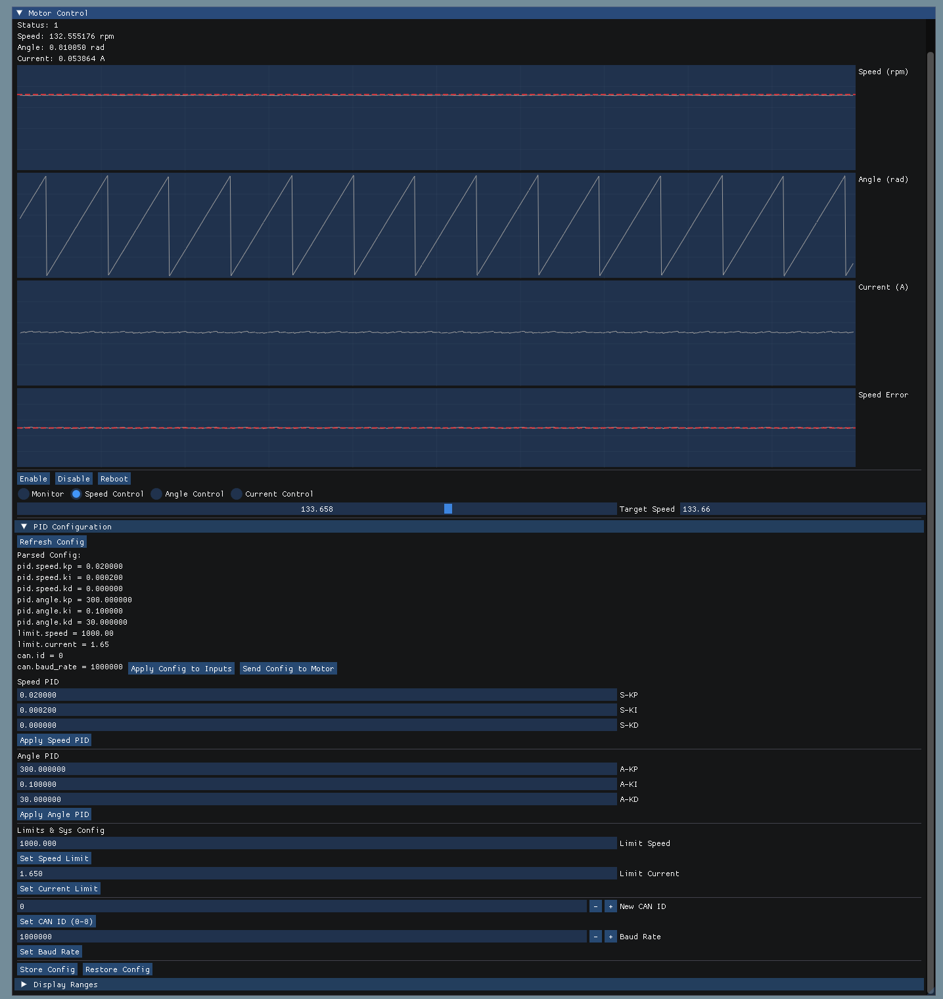

# QDrive SDK (C++)

## 简介

本项目为[QDrive](https://github.com/Liu-Curiousity/QDrive-Software)上位机 cpp 开发工具

正在开发中，欢迎提 issue 和 pr

已知问题： 在 gui 中，未启动 can 可能导致程序崩溃 
点击 disconnect 可能导致程序崩溃

## 代码结构

Driver(驱动部分) 
-> io(通信功能封装) 
-> interfacebase(基础通信协议封装) 
-> interface(高级通信协议封装) 
-> motor(电机功能封装) 
logger(日志功能封装)

## 开发环境

使用 QD4310 电机进行开发和测试

Ubuntu 22.04 
g++ 11.4.0 
boost 1.74

Arch Linux

## 依赖

本项目依赖:

通信基础层：
* [Boost](https://www.boost.org/) (BSL-1.0 License)

日志模块：
* [spdlog](https://github.com/gabime/spdlog) (MIT License)

图形化界面：
* [imgui](https://github.com/ocornut/imgui) (MIT License)

## 拉取和编译

(如果需要调试界面可能需要手动安装 glfw3, arch linux 也是)

`sudo apt install libglfw3-dev pkg-config`

` git submodule update --init --recursive`

` cmake -S . -B build -DCMAKE_BUILD_TYPE=Release && cmake --build build -j`


可以设置 `WITHOUT_GUI=ON` 参数忽略调试界面及其 imgui 依赖 
可以设置 `WITHOUT_LOGGER=ON` 参数忽略日志模块及其 spdlog 依赖 
由于 example 依赖 logger 依赖，会同时忽略 example 部分

### Windows 编译（提供 SLCAN 支持）

1. 在 Windows 机器安装 Visual Studio（推荐 2022），确保包含 `桌面开发（使用C++）` 工作负载以及 CMake 工具。
2. 安装 [vcpkg](https://github.com/microsoft/vcpkg) 并依赖安装所需的 Boost 与 fmt 等依赖：

```bat
vcpkg install boost-headers
```

3. 在项目根目录运行：

```bat
cmake -S . -B build -G "Visual Studio 17 2022" -A x64 -DWITHOUT_GUI=ON -DCMAKE_BUILD_TYPE=Release \
	-DCMAKE_TOOLCHAIN_FILE=C:/path/to/vcpkg/scripts/buildsystems/vcpkg.cmake
cmake --build build --config Release
```

4. 启动 Windows 版 CAN 后端需用 SLCAN 兼容的串口设备（如 PEAK CAN USB 串口模式或 FTDI+slcan 驱动），构造 `Can` 时传入类似 `COM3@500000` 或 `slcan:COM3@250000` 的接口名。
5. 目前仅支持标准 11 位帧（`t` 命令），间隔超时由 100 ms 进行控制；若需要扩展帧（`T`）、远程帧或自定义串口设置，可在 `Driver/io/can/can.cpp` 里扩展。

#### CI/CD 自动测试

本项目使用 GitHub Actions 自动编译测试，覆盖：

- **Linux (Ubuntu 22.04)**：完整构建（含界面）、 `WITHOUT_GUI`、`WITHOUT_LOGGER` 变体
- **Windows (Latest)**：MSVC + vcpkg 完整构建（`WITHOUT_GUI=ON`）

## 运行示例

**可能包含电机使能，电机旋转等操作，注意运行风险**

串口：

单个电机
`./build/example/qdrive_example`

多个
`./build/example/qdrive_example_two`

终端输出
`./build/example/qdrive_example_reader`

can：
单个电机
`./build/example/qdrive_example_can`
或是

终端输出
`./build/example/qdrive_example_reader_can`
或是使用 `candump`

## 脚本

设置 usb rule

``` sh
chmod +x create-udev-rule.sh
./script/create-udev-rule.sh /dev/ttyACM0 QD4310-0 
```

## 工具

调试界面



`./build/tool/gui/qdrive_gui`

串口调试工具

`./build/tool/io/qdrive_tool_serial`

CAN调试工具

`./build/tool/io/qdrive_tool_can`

## 小指令

启动 can 通信

```sh
sudo ip link set can0 up type can bitrate 1000000
```

搜索 can 设备

```sh
ip link show | grep can
```

发送/接收 can 数据

```sh
cansend can0 400#000000
candump can0
```

## 开源声明

本项目使用 [**GNU General Public License v3.0**](https://www.gnu.org/licenses/gpl-3.0.en.html) 许可证

Copyright (C) 2025 marble703

本项目与[QDriver](https://github.com/Liu-Curiousity/QDrive-Software)通过 can/serial 协议进行通信